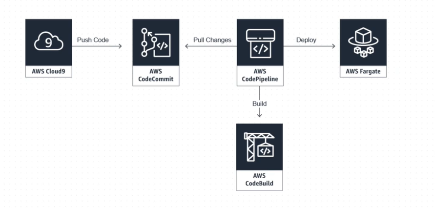
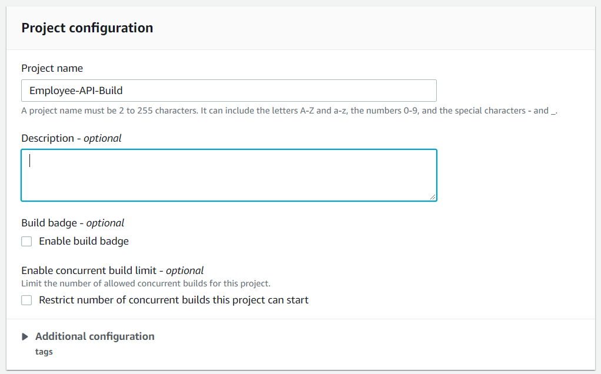
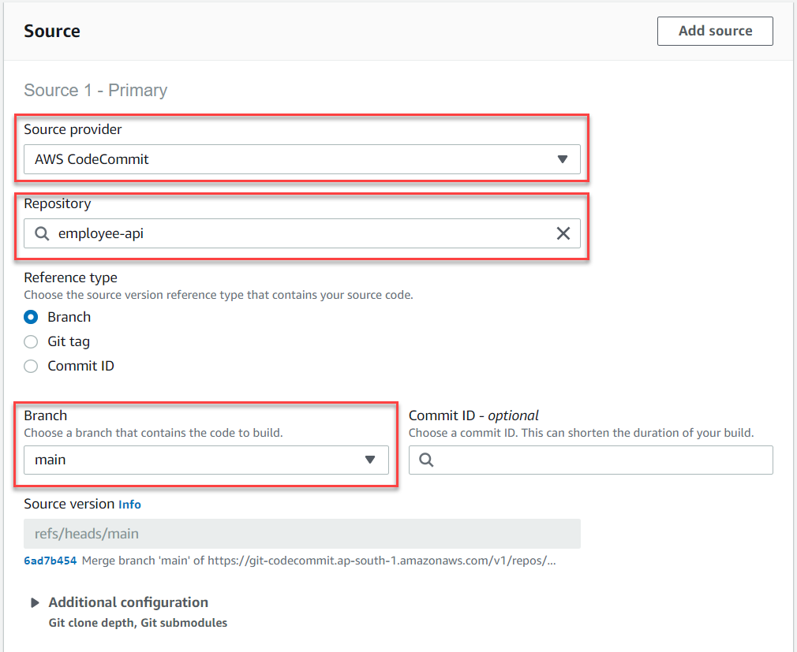
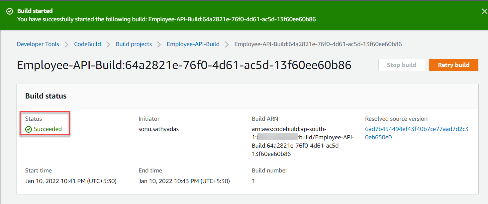
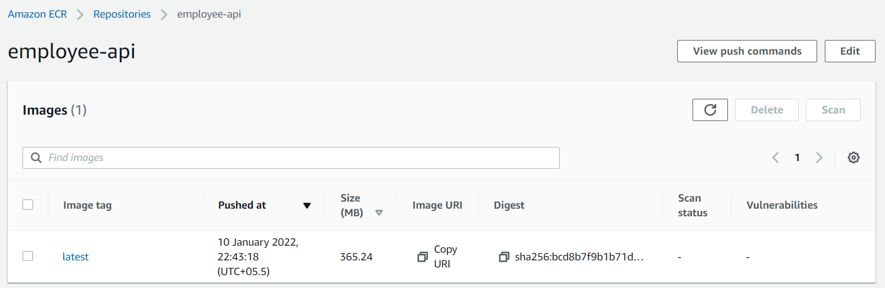

# Enable CI/CD using Code Pipeline


## Setting up IAM user permissions and Http Git Credentials
To perform CodeCommit operations, the IAM user requires some permissions. You also need to obtain the Git credentials (username + password)  to push the code to CodeCommit.

1) Open the AWS management console and navigate to the IAM dashboard.
2) You can create a new IAM user, or use an existing user, in your Amazon Web Services account. Make sure you have an access key ID and a secret access key associated with that IAM user. 
3) In the IAM console, in the navigation pane, choose `Users`, and then choose the IAM user you want to configure for CodeCommit access.
4) On the `Permissions` tab, choose `Add Permissions`.
5) In Grant permissions, choose `Attach existing policies directly`.
6) From the list of policies, select `AWSCodeCommitPowerUser`. After you have selected the policy you want to attach, choose `Next: Review` to review the list of policies to attach to the IAM user. If the list is correct, choose `Add permissions`.
7) Now, you need to generate Git credentials for the IAM user to push the code to CodeCommit. In the IAM console, in the navigation pane, choose `Users`, and from the list of users, choose your IAM user.
8) On the user details page, choose the `Security Credentials` tab, and in `HTTPS Git credentials for AWS CodeCommit`, choose `Generate`.
    
    

9) Copy the user name and password that IAM generated for you, either by showing, copying, and then pasting this information into a secure file on your local computer, or by choosing `Download` credentials to download this information as a .CSV file. You need this information to connect to CodeCommit.

    
    
10) After you have saved your credentials, choose `Close`.

## Push the code to CodeCommit repository
1) Clone the sample application - `employee-api` - to your local machine by running the following command.
    ```bash
    git clone https://github.com/sonusathyadas/aws-codepipeline.git
    cd aws-codepipeline\employee-api        
    ```
2) Initialize the git for the project. Also add all files to staging and commit locally.
    ```bash
    git init
    git add .
    git commit -m "Initial commit"
    ```
3) Now, you need to push the code to AWS code commit.For that, open browser and navigate to AWS management console. Search for `CodeCommit` and navigate to CodeCommit service console.
4) Click on the `Create repository` button. 
5) Specify the repository name as `employee-api` and provide a description. Click on `Create`.
6) Your CodeCommit repository will be created and the page will show the steps to clone the repository using Https. You have the existing project and you can push that code to the new repository. For that copy the http url of the repository from `Step 3` and run the following commands in your terminal locally.
    ```bash
    git branch -M main
    git remote add origin <http-url-of-codecommit-repository>
    git push -u origin --all
    ```
7) This will prompt for the Git credentials for your repository. Enter the Git credentials you have downloaded in the previous step. After the code is successfully pushed you can refresh the CodeCommit window to see the files.

    

## Create a CodeBuild service role
1) Open the IAM console at [https://console.aws.amazon.com/iam/](https://console.aws.amazon.com/iam/). Login to the console with root user credentials or IAM user with Administrator access.
2) In the navigation pane, choose `Policies`. Choose `Create Policy`. On the Create Policy page, choose `JSON`.
3) Enter the following JSON code and click on `Next:Tags`.
    ```json
    {
        "Version": "2012-10-17",
        "Statement": [
            {
                "Sid": "CloudWatchLogsPolicy",
                "Effect": "Allow",
                "Action": [
                    "logs:CreateLogGroup",
                    "logs:CreateLogStream",
                    "logs:PutLogEvents"
                ],
                "Resource": "*"
            },
            {
                "Sid": "CodeCommitPolicy",
                "Effect": "Allow",
                "Action": [
                    "codecommit:GitPull"
                ],
                "Resource": "*"
            },
            {
                "Sid":"CodeBuildPolicy",
                "Effect":"Allow",
                "Action":[
                    "codebuild:CreateReportGroup",
                    "codebuild:CreateReport",                            
                    "codebuild:UpdateReport",
                    "codebuild:BatchPutCodeCoverages",
                    "codebuild:BatchPutTestCases"
                ],
                "Resource":"*"
            },
            {
                "Sid": "S3Policy",
                "Effect": "Allow",
                "Action": [
                    "s3:GetObject",
                    "s3:GetObjectVersion",
                    "s3:GetBucketAcl",
                    "s3:PutObject",
                    "s3:GetObject",
                    "s3:GetBucketLocation",
                    "s3:GetObjectVersion"
                ],
                "Resource": "*"
            },
            {
                "Sid": "ECRPolicy",
                "Effect": "Allow",
                "Action": [
                    "ecr:BatchCheckLayerAvailability",
                    "ecr:GetDownloadUrlForLayer",
                    "ecr:BatchGetImage",
                    "ecr:CompleteLayerUpload",
                    "ecr:GetAuthorizationToken",
                    "ecr:InitiateLayerUpload",
                    "ecr:PutImage",
                    "ecr:UploadLayerPart"
                ],
                "Resource": "*"
            }
        ]
    }
    ```
4) In the tags page you can specify some tags optionally. Click on the `Next:Create` button.
5) On the Review Policy page, for Policy Name, enter a name for the policy - `Custom-CodeBuildServiceRolePolicy`, and then choose `Create policy`.
6) In the navigation pane, choose `Roles`. Then choose `Create role`.
7) On the Create role page, with AWS Service already selected, choose `CodeBuild`, and then choose `Next:Permissions`.
8) On the Attach permissions policies page, select `Custom-CodeBuildServiceRolePolicy`, and then choose `Next: Review`.
9) On the Create role and review page, for Role name, enter a name for the role such as `Custom-CodeBuildServiceRole`, and then choose `Create role`.

## Create a CodeBuild project to build and push Docker image to ECR
1) Open browser and navigate to AWS Management console. Search for `CodeBuild` and navigate to CodeBuild service console.
2) In the CodeBuild console, click on the `Create project` button.
3) In the `Create build project` page, specify the build project name as `Employee-API-Build`. Optionally specify a description.
    
    

4) In the `Source` section, select the `Source provider` as `AWS CodeCommit`. Choose the `employee-api` from the repository search text box. For branch, select `main` branch.

    

5) In the `Environment` section, 

    * Choose `Managed Image` for `Environment image`.
    * Choose operating system as `Ubuntu`.
    * Choose runtime as `Standard`.
    * Select image as `aws/codebuild/standard:5.0`
    * Select Image version as `Always use latest image for this runtime version`.
    * Select the check box for `Privileged` as it is required for Docker image build.
    * For the service role, select `Existing role` and select the `Custom-CodeBuildServiceRole` which your have created in the previous step.
    * Expand the `Additional configuration` section and enter the following environment variables.
        * AWS_DEFAULT_REGION with a value of region-ID
        * AWS_ACCOUNT_ID with a value of account-ID
        * IMAGE_TAG with a value of `latest`
        * IMAGE_REPO_NAME with a value of Amazon-ECR-repo-name (eg: employee-api)
6) For the `Buildspec` section, for `build specifications` select `Insert build commands` . Click on the switch to editor enter the following YAML code.
    ```yml
    version: 0.2
    phases:
      pre_build:
        commands:
          - echo Logging in to Amazon ECR...
          - aws ecr get-login-password --region $AWS_DEFAULT_REGION | docker login --username AWS --password-stdin $AWS_ACCOUNT_ID.dkr.ecr.$AWS_DEFAULT_REGION.amazonaws.com
      build:
        commands:
          - echo Build started on `date`
          - echo Building the Docker image...          
          - docker build -t $IMAGE_REPO_NAME:$IMAGE_TAG .
          - docker tag $IMAGE_REPO_NAME:$IMAGE_TAG $AWS_ACCOUNT_ID.dkr.ecr.$AWS_DEFAULT_REGION.amazonaws.com/$IMAGE_REPO_NAME:$IMAGE_TAG      
      post_build:
        commands:
          - echo Build completed on `date`
          - echo Pushing the Docker image...
          - docker push $AWS_ACCOUNT_ID.dkr.ecr.$AWS_DEFAULT_REGION.amazonaws.com/$IMAGE_REPO_NAME:$IMAGE_TAG
    ```
7) Leave the other fields as default and click on `Create project`.
8) After the project has been created, click on the `Start Build` command button to start the build process.
9) When the build process complete successfully, you will see the success status in the build page.
    
     

10) You can verify the ECR repository to confirm the docker image is build and pushed into the `employee-api` repository

     